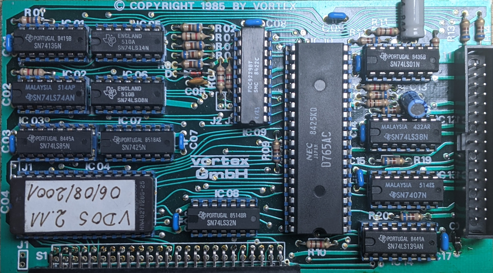
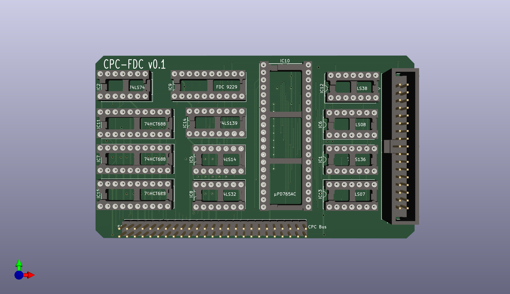
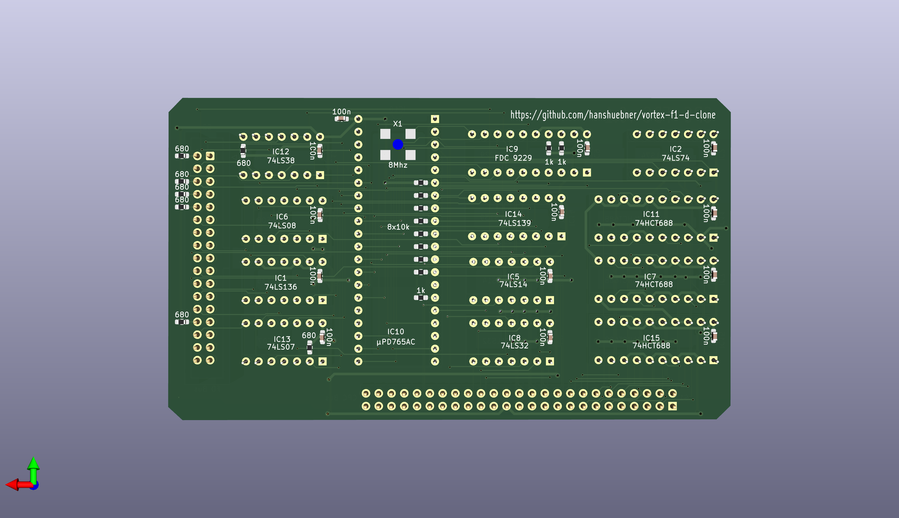
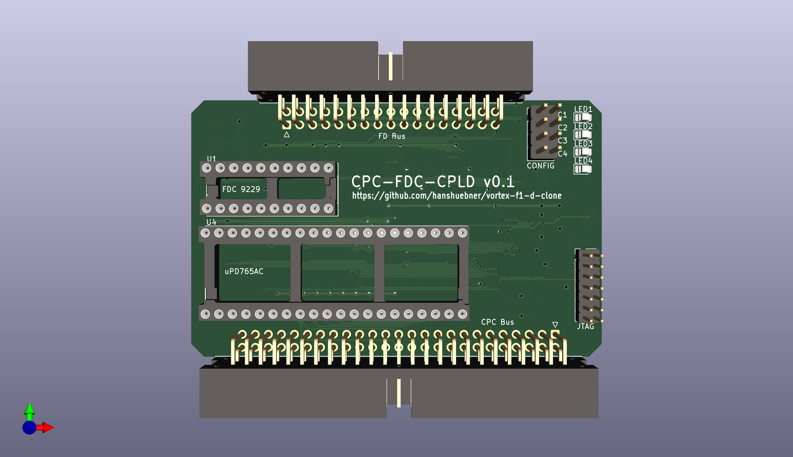
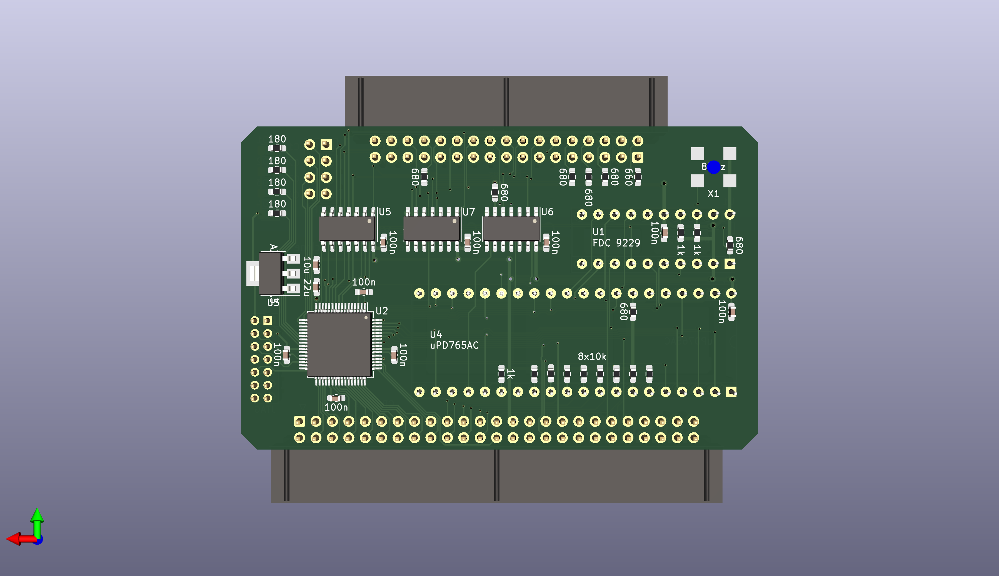
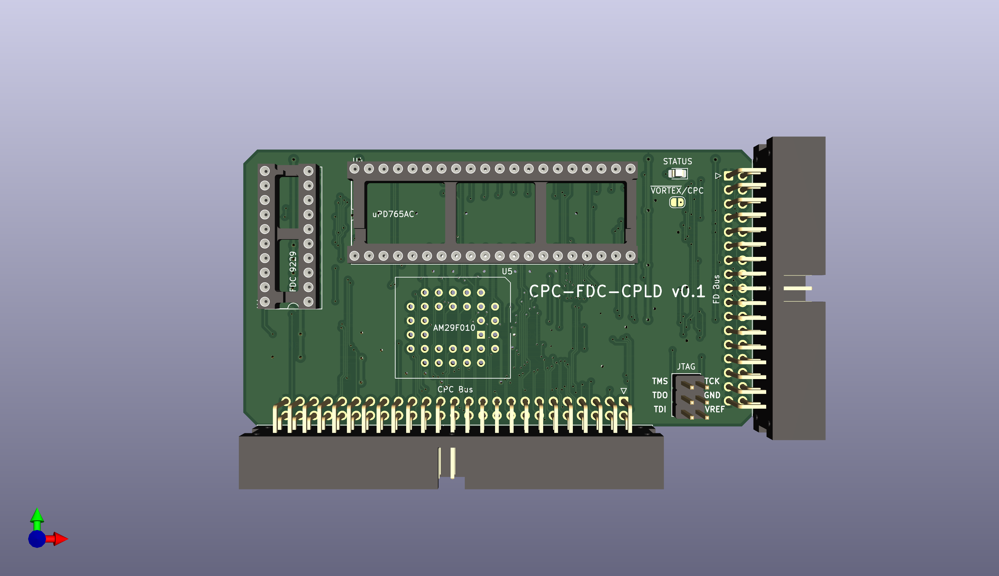
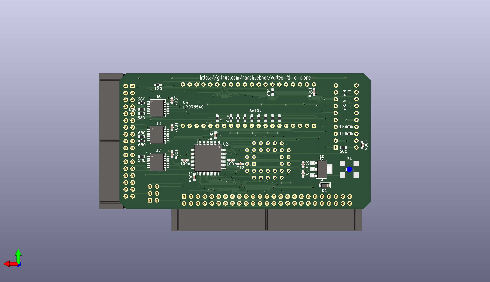

# Amstrad/Schneider CPC floppy controllers

> :warning: **This is a work in progress**: Don't fabricate PCBs from these files yet!

This project started as attempt to clone the Vortex F1-D floppy
controller, which supports two 720k DSDD drives.  The desire was to
have a controller that can support four drives at the same time.  The
starting point was a capture of the original PCB into a schematic,
which can be found in the [original](original/) directory.

Multiple variants have been designed, but none of the designs in this
repository have been tested, don't fabricate any PCBs at this point!

# no-rom

The [no-rom](no-rom/) variant contains a revised, but wasteful address
decoder and no ROM socket.  It works to some extent, but the first
revisions contained multiple errors and required several patches.  The
version in this repository has the fixes applied, but was not yet
fabricated and tested.

# no-rom-cpld

The [no-rom-cpld](no-rom-cpld/) variant replaces the TTL chips with a
CPLD, reducing the part count significantly.

# rom-cpld

The [rom-cpld](rom-cpld/) variant adds a Flash ROM that can act as a universal
ROM box in addition to holding an operating system ROM to drive the
floppy disk controller.

